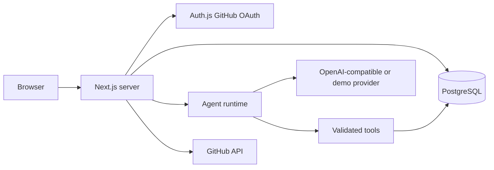

# Architecture

Forge is a Next.js App Router application with server components for reads, server actions for forms, and authenticated route handlers for workflow and GitHub operations. Prisma maps PostgreSQL to typed records. Neon works through its standard PostgreSQL connection string.

Each workflow pre-creates five ordered runs in a serializable database transaction, so a failed setup cannot leave a partial queue. The browser advances one run per request, allowing the dashboard to refresh after each completed agent. Run records, events, tasks, reports, and metrics survive page reloads. This is a polling-based live update path; a background job worker and SSE fan-out are future scaling work.

The AI provider returns structured output. The runtime validates the complete result before any content write, then commits the run completion, tasks, reports, metrics, and completion events in one database transaction. A database claim (`PENDING` to `RUNNING`) prevents two requests from executing the same run; completion checks the claim again so a stale worker cannot write after being replaced. A stale run can be reclaimed after two minutes. Tasks and reports upsert by run and title; metrics upsert by project and normalized key, while preserving an existing key's label and unit. A failed step records a safe error and marks later steps skipped. New workflows can be started after failure.

In live mode the Research run uses a separate controlled search adapter, public-page retriever, and quote-validated synthesis contract. The fixed Brave endpoint returns candidate URLs; Forge checks schemes, DNS answers, redirects, content type, response size, and retrieval time before saving bounded excerpts. The model sees only these untrusted excerpts and cannot select tools or authorize network requests. A complete research session, sources, findings, report, and run completion are committed in one transaction after the run claim is rechecked. The second Founder pass reads only the completed session from its own workflow and gets cited findings rather than an unsupported research claim. Demo mode retains its clearly labeled outline and creates no live evidence session.
