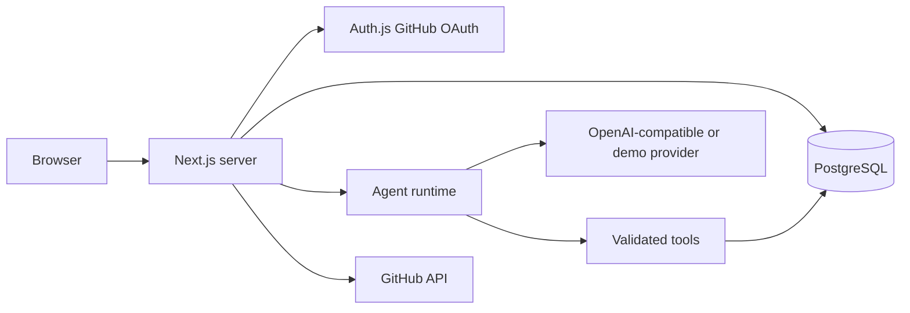

# Architecture

Forge is a Next.js App Router application with server components for reads, server actions for forms, and authenticated route handlers for workflow and GitHub operations. Prisma maps PostgreSQL to typed records. Neon works through its standard PostgreSQL connection string.

Each workflow pre-creates five ordered runs in a serializable database transaction, so a failed setup cannot leave a partial queue. The browser advances one run per request, allowing the dashboard to refresh after each completed agent. Run records, events, tasks, reports, and metrics survive page reloads. This is a polling-based live update path; a background job worker and SSE fan-out are future scaling work.

The AI provider returns structured output. The runtime validates it and applies it through scoped tools. A database claim (`PENDING` to `RUNNING`) prevents two requests from executing the same run. A stale run can be reclaimed after two minutes; task, report, and metric writes are idempotent per run. A failed step marks later steps skipped. New workflows can be started after failure.
